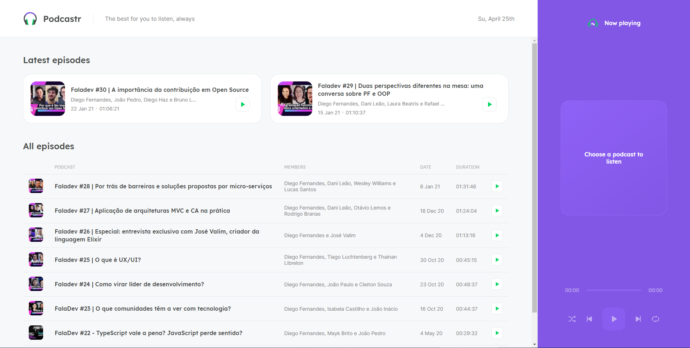

# Podcastr



A [Next.js](https://nextjs.org/) server-side rendered [ReactJS](https://reactjs.org/) webapp.

Podcastr is a web applicationn where you can listen to Podcastr podcasts.

Stay on top of the latest releases and listen to the podcasts on the site.

## Table of Contents

- [Install](#install)
- [Usage](#usage)
- [Contributing](#contributing)
- [License](#license)

## Install

Prerequisites:

Download and install [Node.js](https://nodejs.org/en/download/) and [Yarn](https://classic.yarnpkg.com/en/docs/install/).


- First, clone the repository:
```bash
git clone https://github.com/erickmp07/podcastr.git
```

- Install its dependencies with [`yarn` command](https://classic.yarnpkg.com/en/docs/usage):
```bash
cd podcastr
yarn
```

## Usage

First, start the server:
```bash
yarn server
```

Then, o run the app in the develop mode:
```bash
yarn dev
```

Note: To build the application as the production mode:
```bash
yarn build
```

Note: To run the application in the production mode:
```bash
yarn start
```

The application can be accessed at [`localhost:3000`](http://localhost:3000).

## Contributing

PRs and stars are always welcome.

To ask a question, please [contact me](mailto:erimacedo_92@hotmail.com).

## License

Licensed under [MIT](LICENSE) license.